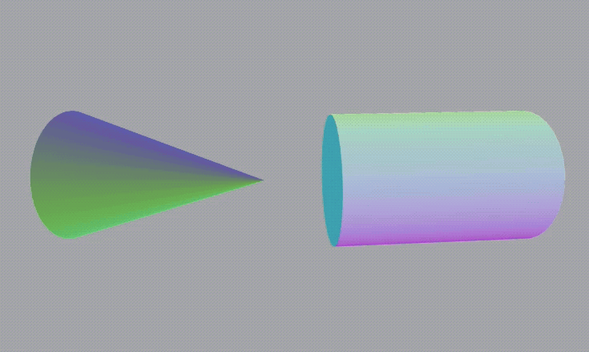
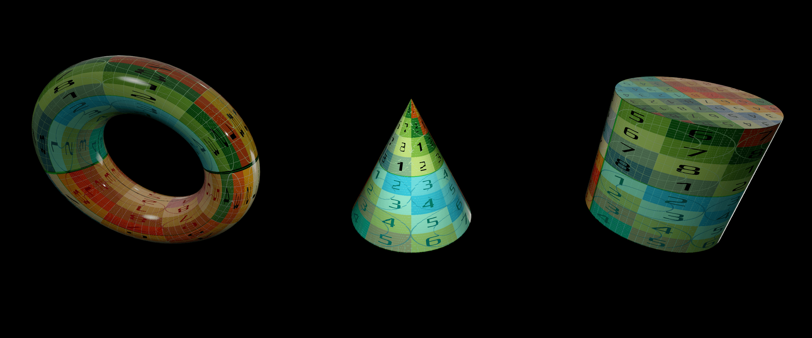
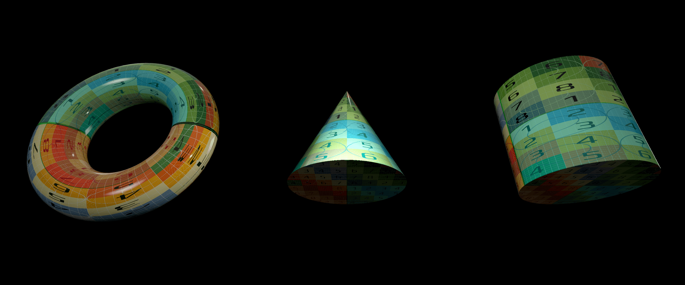

# RealityGeometries

> Add more geometries to your RealityKit projects

> [!NOTE]
> Now with visionOS support!

  
  
   
  
  

By default, the only shapes available in RealityKit are a Sphere, Cuboid and Plane (with 4 vertices). Until iOS 15 the only clean way to include more geometries in your project is to load them from a USDZ file, which could unnecessarily increase the size of your app, especially when the shape you want to add is a basic one such as a cylinder or cone.

  

RealityGeometries is a solution to increase the basic mesh offering from RealityKit.

## Included in RealityGeometries
- Cylinder
- Cone
- Plane (with more vertices)
- Path
- Torus

This repository is open to pull requests as well as feature requests.

## More Images

  
  

